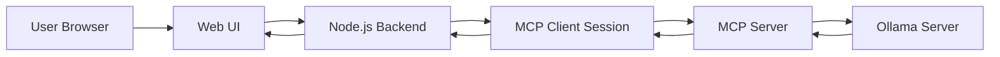
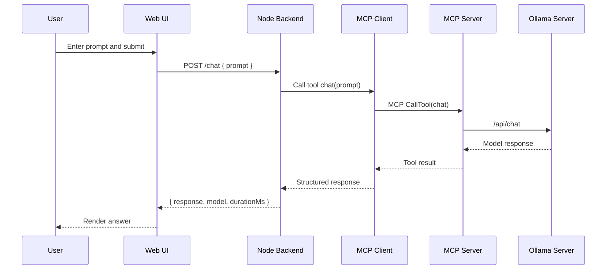
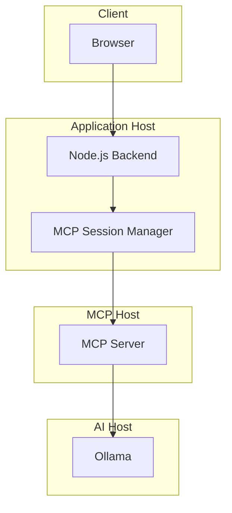

# Architecture

## Purpose
Define the target architecture for a simple web UI and Node.js backend that invoke MCP tools, where the MCP server communicates with Ollama for model inference.

## System Overview
1. User interacts with a browser UI.
2. UI calls Node.js backend endpoints.
3. Backend calls MCP tools through a persistent MCP client session.
4. MCP server translates tool calls into Ollama API requests.
5. Ollama returns model responses back through the same chain.

## Component Diagram

## Request Flow: Chat

## Deployment View

## Backend API Contracts
1. GET /health
- Returns backend, MCP, and Ollama status.

2. POST /chat
- Input: prompt string
- Output: response string, model, durationMs

3. POST /summarize
- Input: text string, optional style
- Output: summary string, model

## MCP Tool Contracts
1. health_check
- Input: none
- Output: status, model, message

2. chat
- Input: prompt
- Output: response, model

3. summarize
- Input: text and optional style
- Output: summary, model

## Runtime Decisions
- Keep one persistent MCP client session in backend process.
- Use fail-fast behavior for unreachable MCP or Ollama dependencies.
- Enforce configurable request timeout on backend and MCP layers.
- Keep tools stateless in MVP.

## Error Handling
1. Validation errors: return HTTP 400 from backend.
2. MCP unavailable: return HTTP 503 with actionable message.
3. Ollama timeout: return HTTP 504 with timeout context.
4. Unexpected downstream errors: return HTTP 502 with correlation ID.

## Security Baseline
- Backend is the only browser-facing component.
- Do not expose Ollama directly to the frontend.
- Add request body size limits.
- Redact sensitive text from error logs.

## Observability Baseline
- Correlation ID on every request.
- Structured logs in backend and MCP layers.
- Basic metrics: request count, error rate, p50/p95 latency.

## Milestones
1. Foundation
- MCP server and tools operational locally.

2. MVP
- UI to backend to MCP to Ollama path working end-to-end.

3. Hardening
- Improved error handling, observability, and docs.

## Acceptance Criteria
- Health endpoint reflects true downstream status.
- Chat and summarize return expected payloads.
- Timeout and unreachable-host failures are user-actionable.
- No direct browser calls to Ollama.
